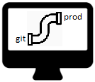

# AWS Serverless App Pipeline



This is an end-to-end pipeline solution for an AWS S3 static website with serverless Lambda backend in Node and Python, Terraform IaC and deployment pipelines in Azure DevOps.

The author does take any responsibility for any issues resulting from using this software. Please see the [LICENCE](LICENSE) file for details.

This project has been inspired by the [AWS Serverless Web App Tutorial](https://aws.amazon.com/getting-started/hands-on/build-serverless-web-app-lambda-apigateway-s3-dynamodb-cognito/).

## Table of Contents

-   [Default Environment](#default-environment)
-   [Application Website](#application-website)
-   Specific README File
    -   [Azure DevOps Pipelines README](pipelines/README.md)
    -   [Infrastructure as Code (Terraform) README](terraform/README.md)
    -   [Lambda Functions README](lambda-src/README.md)
    -   [API Tests README](api-tests/README.md)
    -   [UI Tests README](ui-tests/README.md)

## Default Environment

You can setup the default environment for the AWS serverless application using a handy setup script in the top directory of this repository.

Please make sure you have the **Terraform** prerequisites installed and setup. The details are available in the [Terraform README](terraform/README.md).

**WARNING**

You might incur AWS costs when deploying the application depending on your account pricing tier.

### Setting up the default AWS environment

Run:

```bash
sh setup-default-environment.sh
```

This will deploy the application to AWS and return the URL at which you can access the website.

### Bringing the default AWS environment down

Run:

```bash
sh destroy-default-environment.sh
```

This command will remove all AWS resources from the **default** Terraform workspace.

## Application Website

Using the [W3 Schools](https://www.w3schools.com/w3css/w3css_templates.asp) template for a basic website. As their site mentions "You are free to modify, save, share, and use them in all your projects."

### CORS

CORS is not a big problem within the dynamic environment as both the S3 static website and the Lambda functions exposed via API Gateway run off
the Amazon main domain.

When developing the project into a proper-hosted domain (e.g. "https://www.myawesomewebsite.com/) then CORS would need to be addressed as the website
will be running in its own domain and the API Gateway resources will be running in a separate one. Additional Terraform resources will need to be added for that.

Testing CORS with jQuery in the website using **Chrome Developer Tools**:

```javascript
$.get(`${_config.apiUrl}/hello-node`, data => console.log(data));
```

If the call fails then there is an issue with CORS that needs addressing in AWS API Gateway.
