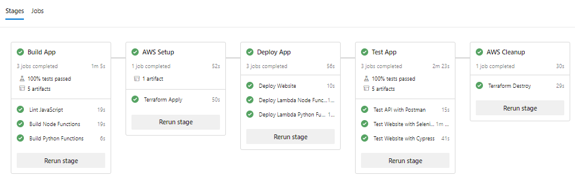

# Azure DevOps Pipelines

The project is configured to but used with Microsoft Azure DevOps Pipelines. The YAML files in this directory describe the CI/CD pipelines in code.



|Environment|Build Status|
|-----------|------------|
|[Default](http://miroslawmajka-aws-serverless-app-default.s3-website-eu-west-1.amazonaws.com/)|[](https://dev.azure.com/miroslawmajka/aws-serverless-app/_build/latest?definitionId=2&branchName=master)|
|Dynamic|[](https://dev.azure.com/miroslawmajka/aws-serverless-app/_build/latest?definitionId=1&branchName=master)|

## Setup Steps

Install Terraform from Azure DevOps Marketplace:

```
A task is missing. The pipeline references a task called 'terraformInstaller'. This usually indicates the task isn't installed, and you may be able to install it from the Marketplace: https://marketplace.visualstudio.com. (Task version 0, job 'TerraformApply', step ''.)
A task is missing. The pipeline references a task called 'terraformInstaller'. This usually indicates the task isn't installed, and you may be able to install it from the Marketplace: https://marketplace.visualstudio.com. (Task version 0, job 'TerraformDestroy', step ''.)
```

## Sensitive Files

Put AWS credentials in the library

Permit pipeline access to sensitive files

Warning about incurring costs from AWS / Azure DevOps
